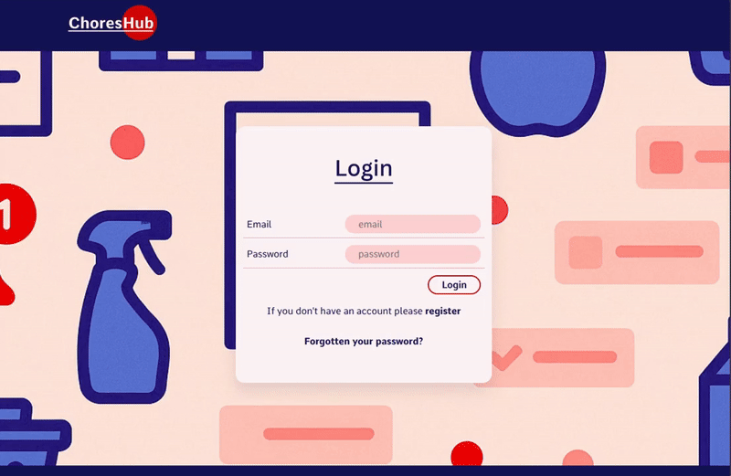

# Chores Hub
Minimalist full-stack household chores management app with n-layered architecture.

<p align="center">
  
</p>

## Table of Contents
* [Tech Stack](#tech-stack)
* [Getting Started](#getting-started)
* [Configuration](#configuration)
* [Features](#features)

## Tech Stack

| Category | Technology |
| :--- | :--- |
| **Frontend** |     |
| **Backend** |     |
| **Database** |   |


## Getting Started
**Prerequisites:** Node.js, .NET 8 SDK, Entity Framework Core CLI tool and PostgreSQL.

**CLIENT**
- From `/client`.

   ```
   npm install
   ```
   ```
   npm start
   ```
- Vite dev server runs on port 3030 `(vite.config.js)`.

**SERVER**
- Entity Framework Core CLI tool required. From `/server`

  ```
  dotnet ef migrations add InitialCreate --project ChoresHub.Infrastructure --startup-project ChoresHub.WebAPI
  ```
  ```
  dotnet ef database update --project ChoresHub.Infrastructure --startup-project ChoresHub.WebAPI
  ```

- .NET 8 SDK required. Run with dotnet run in server/ChoresHub.WebAPI/.

   ```
   dotnet run
   ```


## Configuration

### CLIENT
- API URL is set via VITE_API_BASE_URL in `.env.development` and `.env.production`.

### Server
- Configure `server/ChoresHub.WebAPI/appsettings.Development.json` for local development.
- Configure `server/ChoresHub.WebAPI/appsettings.Production.json` for production.
- Required settings include:
  - `ConnectionStrings:ChoresHubDb`
  - `JwtSettings` (`Issuer`, `Audience`, `SecretKey`)
  - `CloudinarySettings` (`CloudName`, `ApiKey`, `ApiSecret`)
  - `EmailSettings` (`SmtpHost`, `SmtpPort`, `SenderName`, `SenderEmail`, `SenderPassword`)
  - `Cors:AllowedOrigins`
  - `ClientApp:BaseUrl`

## Features
- Register and log in
- Create tasks, notifications, and shopping lists
- Update profile (photo, name, email, password)
- Reset password
- Mark others' tasks as done
- Mark others' notifications as seen
- Mark others' shopping items as bought
- Delete account


